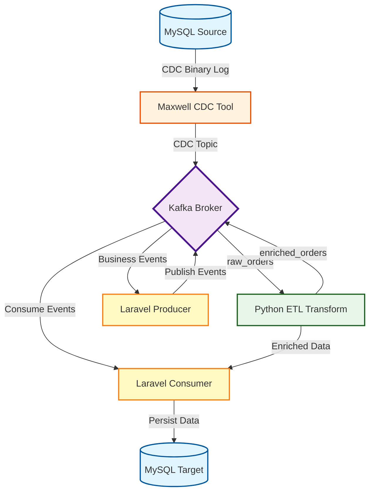

# Kafka ETL Training Project

Repositori ini menyatukan contoh arsitektur **event-driven ETL** berbasis **Apache Kafka**, dua aplikasi **Laravel 10** (producer & consumer), worker **Python** untuk transformasi, serta integrasi **CDC** lewat Maxwell. Materi ditujukan untuk memahami pola data engineering di ranah Higher Education OLAP (THE & IKU metrics).

## Ringkasan Proyek

- **Stack utama**: Kafka (KRaft mode), Laravel + mateusjunges/laravel-kafka, Python + confluent-kafka, MySQL 8 CDC-ready, Docker Compose.
- **Fokus pembelajaran**: message broker fundamentals, integrasi Laravel ↔ Kafka, ETL streaming Python, CDC Maxwell, dan hardening produksi (Supervisor, monitoring, tuning).
- **Output**: peserta dapat membangun pipeline order-processing/OLAP end-to-end, mulai dari sumber MySQL → Kafka → Python ETL → Laravel/MySQL target.

## Tujuan Pembelajaran

1. Menjelaskan konsep message broker, pub/sub vs queue, dan delivery semantics.
2. Memahami arsitektur Kafka (topics, partitions, offsets, consumer group, KRaft).
3. Menghubungkan aplikasi Laravel ke Kafka sebagai producer maupun consumer.
4. Membangun worker ETL Python untuk melakukan enrichment & routing event.
5. Mengoperasikan CDC via Maxwell (MySQL binlog) sebagai sumber data real-time.
6. Men-deploy stack berbasis Docker dengan praktik produksi (monitoring, tuning, security checklist).

## Arsitektur & Alur Data



**Alur singkat**

1. MySQL sumber menulis perubahan ke binary log.
2. Maxwell membaca binlog dan menyalurkan event CDC ke topic bertema domain (`app_producer.*`).
3. Python ETL (manualpy / example-python) memperkaya payload.
4. Laravel Producer menambah event bisnis yang berasal dari HTTP API.
5. Laravel Consumer / Python Sink menyimpan data ke MySQL target (`app_consumer`).
6. Opsional: n8n menjalankan workflow otomatis, Kafka UI (8080) mengecek topik, Supervisor menjaga worker.

## Struktur Repositori

```
PemateriKafka/
├── docker-compose.yml         # Single-node Kafka + Kafka UI (jaringan pelatihankafka_default)
├── servers/                   # Layer aplikasi Laravel + MySQL + Supervisor
│   ├── docker-compose.yml     # Producer, consumer, consumer-daemon, mysql_servers
│   ├── producer/              # Laravel HTTP API (publish raw_orders)
│   └── consumer/              # Laravel worker/ingestor (consume enriched_orders)
├── etl/                       # Komponen ETL (extract, transform, sink, n8n)
│   ├── extract/example-maxwell/   # Maxwell CDC + MySQL metadata
│   ├── transform/example-python/  # Worker Python enrichment
│   ├── sink/example-python/       # Worker Python sink → MySQL
│   └── n8n/                       # Low-code automation stack
├── GEMINI.md, KAFKA_ETL_GUIDE.md, kafka-olap-guide.md
└── OUTLINES.md, PROMPTS.md, OUTLINEV2.md, AGENTS.md
```

## Matriks Komponen

| Layer / Layanan           | Path                                   | Teknologi Kunci                         | Peran Utama                                                      |
| ------------------------- | -------------------------------------- | --------------------------------------- | ---------------------------------------------------------------- |
| Kafka Core                | `docker-compose.yml`                   | Kafka 7.6.1 (KRaft), Kafka UI           | Broker pusat, topic management, monitoring UI (8080).            |
| Laravel Producer          | `servers/producer`                     | Laravel 10 + mateusjunges/laravel-kafka | API HTTP (port 7001) untuk publish event.                        |
| Laravel Consumer          | `servers/consumer` & `consumer-daemon` | Laravel 10, Supervisor, rdkafka         | Worker (port 7002) untuk konsumsi/persist event.                 |
| MySQL (apps)              | `servers/mysql_servers`                | MySQL 8 CDC ready                       | Database sumber/target (app_producer & app_consumer).            |
| Maxwell CDC               | `etl/extract/example-maxwell`          | Maxwell daemon + MySQL metadata         | CDC MySQL → Kafka topic bertema domain.                          |
| Python ETL Transform      | `etl/transform/example-python`         | Python 3.9, confluent-kafka             | Enrichment payload, republikasikan topic lanjutan.               |
| Python ETL Sink           | `etl/sink/example-python`              | Python 3.9, MySQL connector             | Commit manual offset, UPSERT data ke `app_consumer.orders`.      |
| n8n Automation (opsional) | `etl/n8n`                              | n8n, MySQL                              | Workflow otomatis (alerting, ops tooling) di jaringan yang sama. |

## Skenario Praktikum Utama

- **Higher-Education OLAP Metrics (THE & IKU)**
  - Maxwell menyaring skema domain (`siakad.*`, `sdm.*`, dsb.) lalu menulis ke topic `siakad.mahasiswa`.
  - Transform job meng-agregasi metrik harian dan mengirim ke topic analitik atau MySQL warehouse.
  - n8n atau dashboard eksternal membaca data untuk reporting real-time.

## Dokumentasi & Referensi

- `servers/README.md` & `etl/README.md` – detail masing-masing workspace.
- `INSTALLATION.md` – panduan instalasi menyeluruh (lihat bagian berikutnya).

## Cara Memulai Singkat

1. **Penuhi prasyarat**: Docker Desktop 4.26+/Engine 24+, Compose V2, PHP 8.1+, Python 3.9+, Node.js 18+ (opsional).
2. **Clone repo & siapkan environment** (`cp servers/producer/.env.example servers/producer/.env`, generate `APP_KEY`).
3. **Jalankan broker Kafka** dari root: `docker compose up -d` lalu cek `http://localhost:8080`.
4. **Boot layanan aplikasi**: `cd servers && docker compose up -d --build`, pastikan `mysql_servers` sehat.
5. **Aktifkan ETL**: jalankan container `etl/transform/example-python` dan `etl/sink/example-python`.
6. **Opsional**: aktifkan Maxwell (`etl/extract/example-maxwell`) dan n8n (`etl/n8n`).
7. **Uji alur**: kirim order via producer API (`http://localhost:7001/api/orders`) atau Artisan command, lalu pantau consumer log.

Detail lengkap setiap langkah, variabel lingkungan, serta verifikasi tersedia di `INSTALLATION.md`.

## Monitoring & Troubleshooting Cepat

- Daftar topic: `docker exec kafka kafka-topics.sh --bootstrap-server localhost:9092 --list`.
- Cek lag consumer: `docker exec kafka kafka-consumer-groups.sh --bootstrap-server localhost:9092 --group etl-workers --describe`.
- Health MySQL: `docker exec mysql_servers mysql -uroot -proot -e "SHOW BINARY LOGS; SELECT COUNT(*) FROM app_consumer.orders;"`.
- Supervisor consumer: `docker exec consumer-daemon supervisorctl status`.
- Jika producer timeout, cek `docker logs kafka` dan konektivitas jaringan `pelatihankafka_default`.
